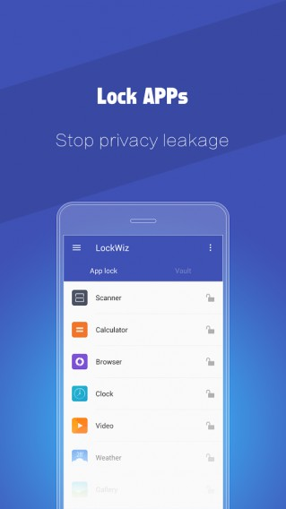
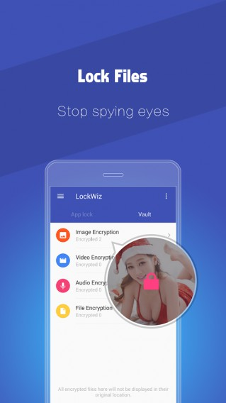
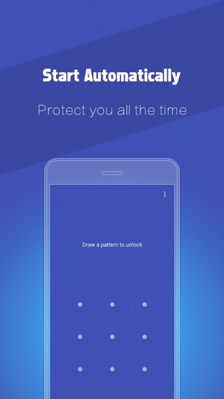

# ToolWizAppLock - Smart App Lock
## About

### Screenshot

## Information

### PRIVACY IS A BASIC HUMAN RIGHT

**LockWiz** is an amazing way to protect your privacy and security on your Android phone. With LockWiz, you will never worry too much about the leakage of your personal sensitive date. Once you set lock for individual APPs and encrypt multimedia files – nobody will be able to access them without a correct master password - giving you entire control over who sees what.

##### Features:

* **Protect your messages**: SMS, call logs, photos, videos, emails and more private content on your Android device.

*  **Keep your social media APPs protected**: Facebook, Twitter, Instagram, Pinterest, Tumblr, WhatsApp, WeChat etc.

*  **Set controls for the games and APP store**: prevent your kids from game addiction and random purchase.

* **Encrypt almost all multimedia files your phone**: images, GIF animation files, documents, videos & audios and other files.

##### Top features of LockWiz:
* Brand new user interface: simpler, sleeker, more intuitive and easier to use.

* Take a snapshot of the person who entered wrong password up to three times.

* A new cool Vault - it's where you can encrypt strongly sensitive files and keep hold of them in it.

* LockWiz can now be protected against accidental deletion. So it will not be deleted, unless the protection is removed.

#### Contact us
Fore more information, please visit [www.toolwiz.com](http://www.toolwiz.com/).

If you have any question about LockWiz, please send an email to admin@btows.com

## Library
To config this project, you need to add three addtional libraries:

1. [MaterialDesignLibrary](https://github.com/navasmdc/MaterialDesignLibrary)

2. [PhotoView](https://github.com/chrisbanes/PhotoView)

3. [Wheel](https://github.com/chemalarrea/Android-wheel)
